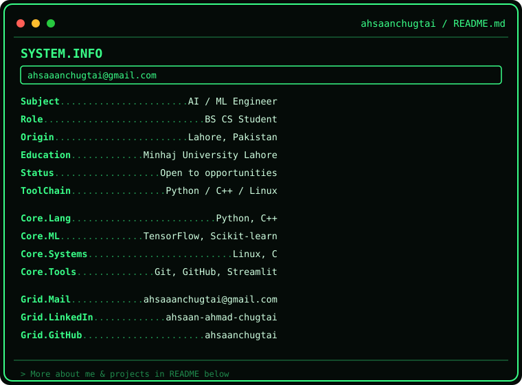
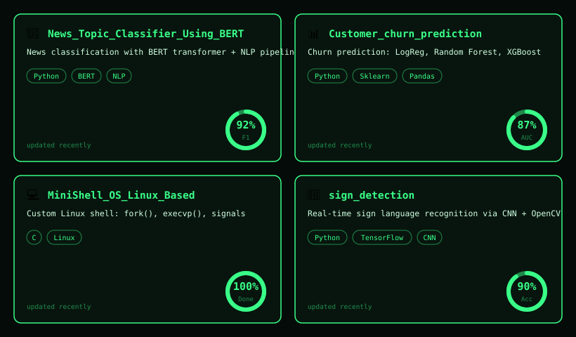

<h1 align="center">Hi 👋, I'm Ahsaan Ahmad Chugtai</h1>
<h3 align="center">Computer Science Student | Machine Learning & Data Science Enthusiast | Systems Programmer</h3>

  

  
  
  

---

### 🧑‍💻 About Me

  

---

### 🚀 Featured Projects

  

  <a href="https://github.com/ahsaanchugtai/-News_Topic_Classifier_Using_BERT">News Topic Classifier (BERT)</a> ·
  <a href="https://github.com/ahsaanchugtai/Customer_churn_prediction">Customer Churn Prediction</a> ·
  <a href="https://github.com/ahsaanchugtai/MiniShell_OS_Linux_Based">MiniShellOS</a> ·
  <a href="https://github.com/ahsaanchugtai/sign_detection">Sign Language Detection</a>

---

### 🛠️ Technical Skills

**Programming Languages**

**Machine Learning & Data Science**

*Logistic Regression • Random Forest • XGBoost • Model Evaluation (ROC-AUC, Confusion Matrix) • PCA Visualization*

**Tools & Platforms**

**Core Concepts**
Data Structures & Algorithms • Object-Oriented Programming • Model Deployment • Problem Solving

---

### 📊 GitHub Stats

  
  

  

---

### 🎓 Education

**BS Computer Science** — Minhaj University Lahore (2023 – Present) · GPA: 3.38/4
**ICS (Physics)** — Government College Township, Lahore (2021 – 2023)
**Matriculation (Computer Science)** — City District Boys Government School, Township Lahore (2019 – 2021)

---

### 🏆 Certifications & Achievements

- **AI & Machine Learning Development Internship** — Developer Hub (2026)
- **Machine Learning & Data Science Internship** — Decode Labs (2026)

---

### 🌐 Languages

Urdu (Native) • English

---

<i>Thanks for visiting my profile — feel free to explore my repositories and connect!</i>

